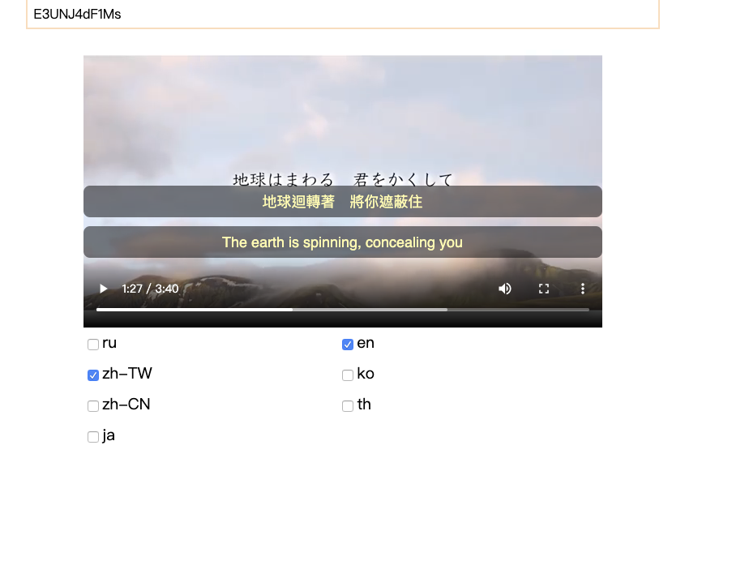
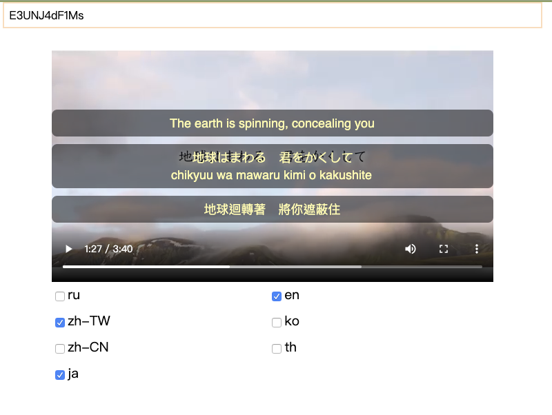

# yt-subtitles

## Watch two different subtitles in the same time , if exist two or many subtitles

## How to run

-   npm install
-   npm run build
-   npm start
-   open http://localhost:8080

## stacks

-   backend

    -   express
    -   youtube-dl

-   frontend
    -   react
    -   axios
    -   vtt.js
-   builder
    -   parcel-bundler
